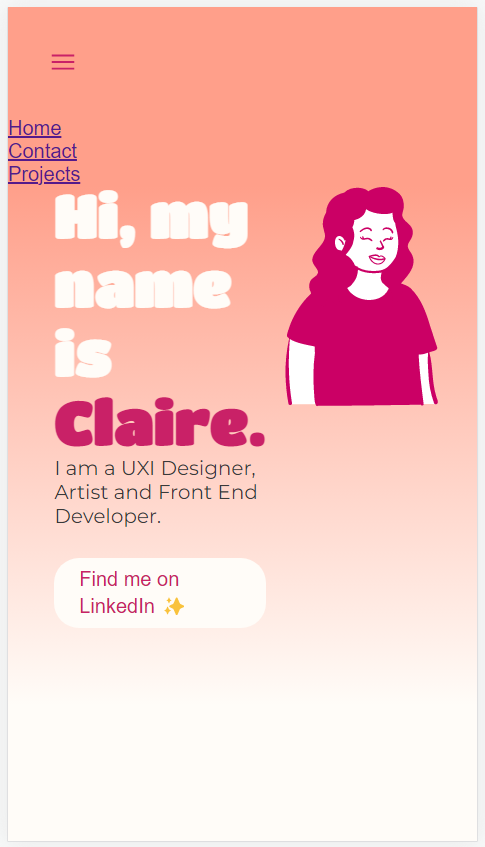
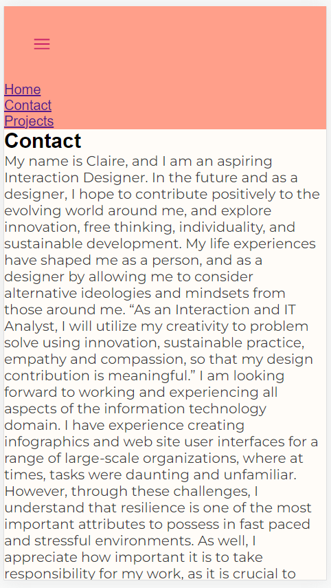
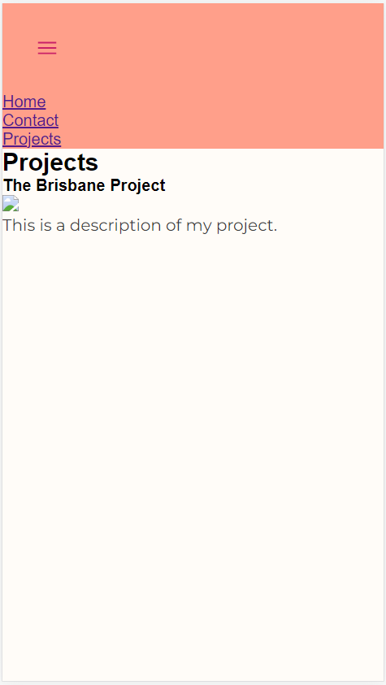
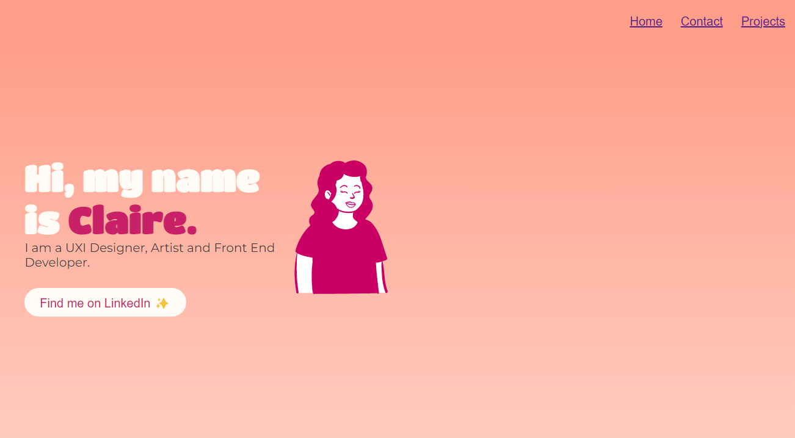
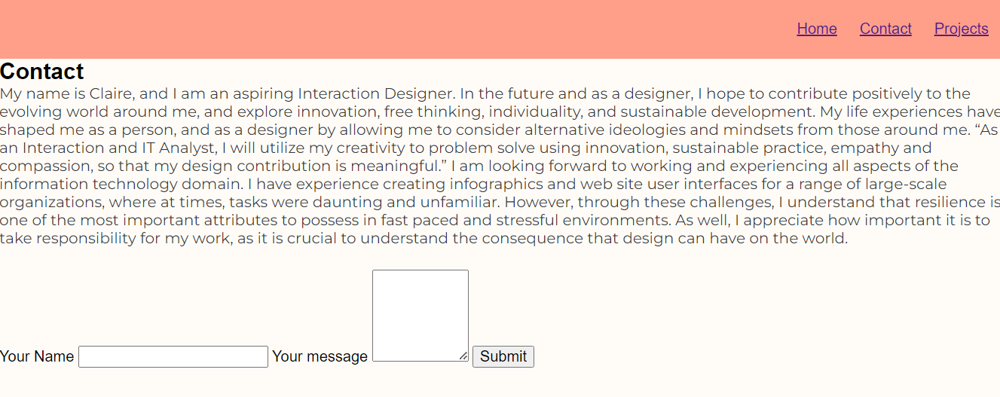
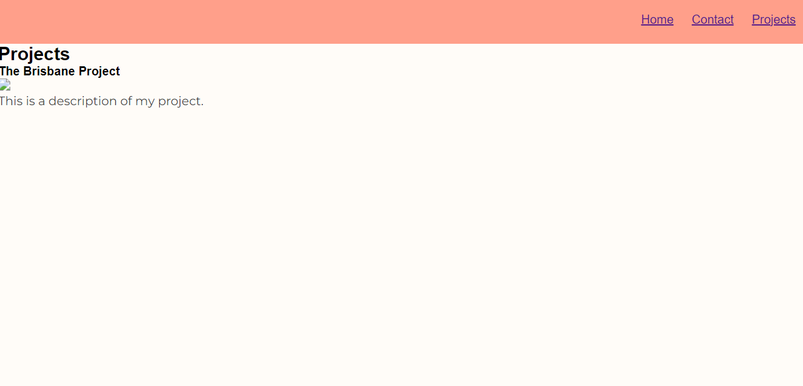

# Claire Delosa - Portfolio Task
[My portfolio site]( https://clairebridge.github.io/she-codes-portfolio/ )
## Project Requirements
### Content
{{ Add a short paragraph describing the features below. }}
- At least one profile picture [Person illustration on index.html ] 
- Biography (at least 100 words) [Biography on contact page] 
- Functional Contact Form [The form is on the contact page. It is not functional yet.] 
- "Projects" section [Dedicated project page, with project title, image and description] 
- Links to external sites, e.g. GitHub and LinkedIn. [Button on index.html that takes to LinkedIn profile]
### Technical
{{ Add a short paragraph describing the features below. }}
-  At least 2 web pages. [3 web pages, linked through navigation bar]
- Version controlled with Git [History of commits on git avaiable] 
-  Deployed on GitHub pages. [Pages are deployed and live] 
-  Implements responsive design principles. [Designed and coded mobile first, Navigation is semi responsive. Needs more work]
-  Uses semantic HTML. [Attempted, but needs refinement]
### Bonus (optional)
{{ Add a short paragraph describing the features below, if you included any. }}
- Different styles for active, hover and focus states. [N/A at this stage, will add in future iterations ] 
-  Include JavaScript to add some dynamic elements to your site. (Extra
tricky!) [N/A will add in future iterations]
### Screenshots
> Please include the following:

> - The different pages and features of your website on mobile, tablet and
desktop screen sizes (multiple screenshots per page and screen size).
> - The different features of your site, e.g. if you have hover states, take a
screenshot that shows that.
>
> You can do this by saving the images in a folder in your repo, and including
them in your readme document with the following Markdown code:

## Mobile View

### Mobile Index

### Mobile Contact

### Mobile Projects

___

## Desktop View

### Desktop Index

### Desktop Contact

### Desktop Projects
